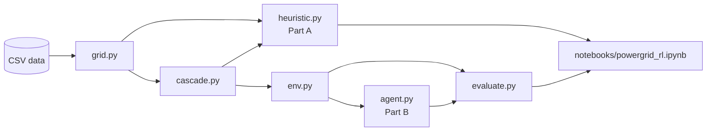
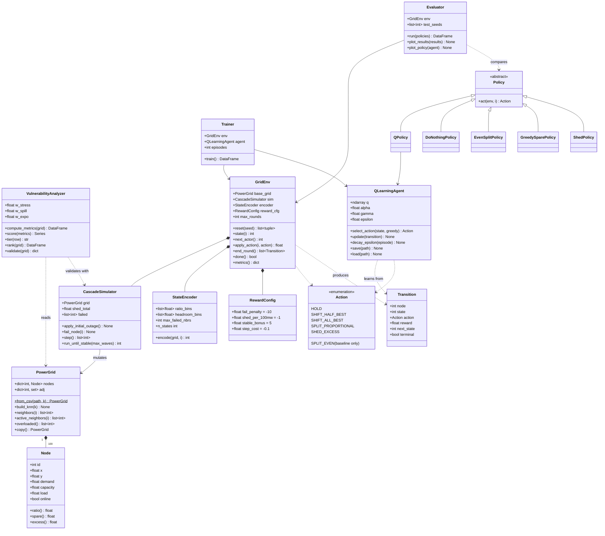
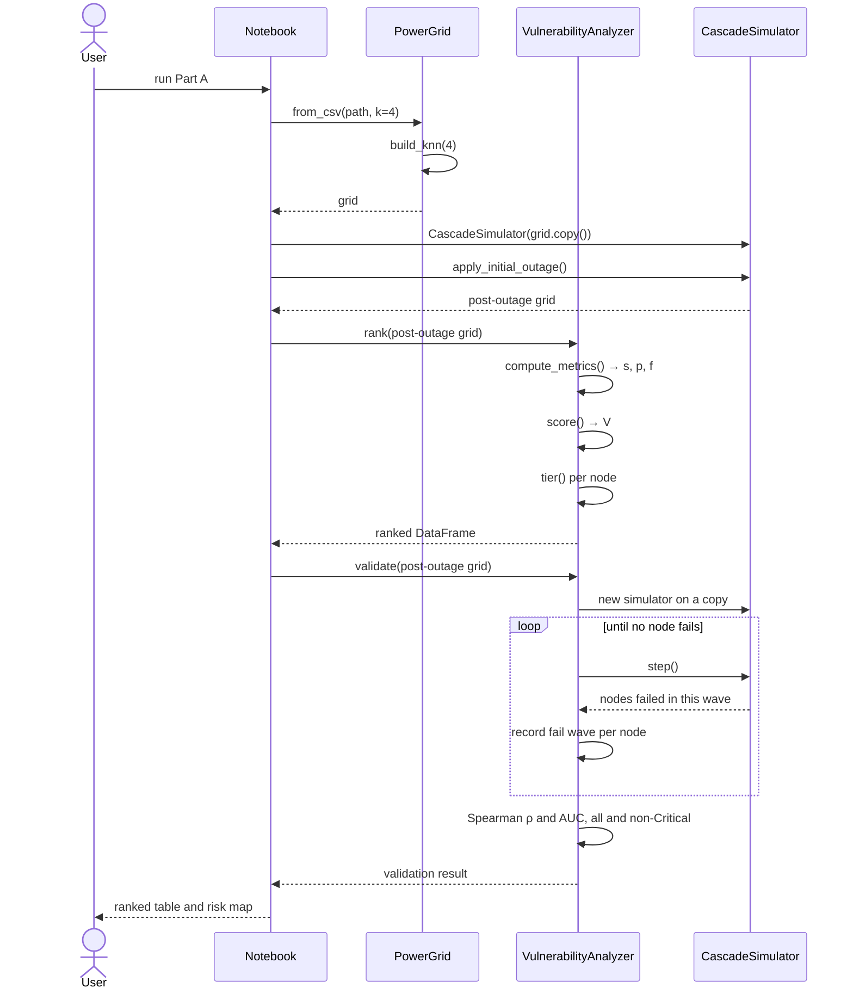
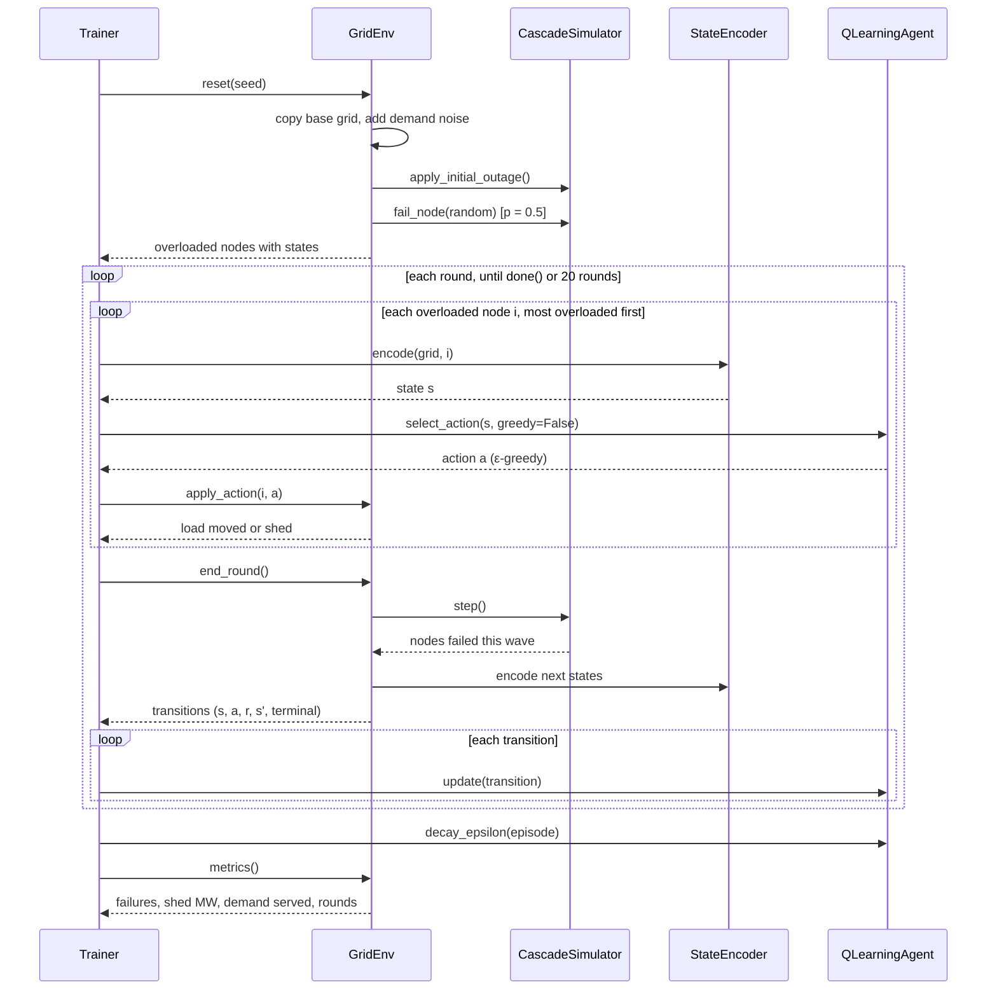
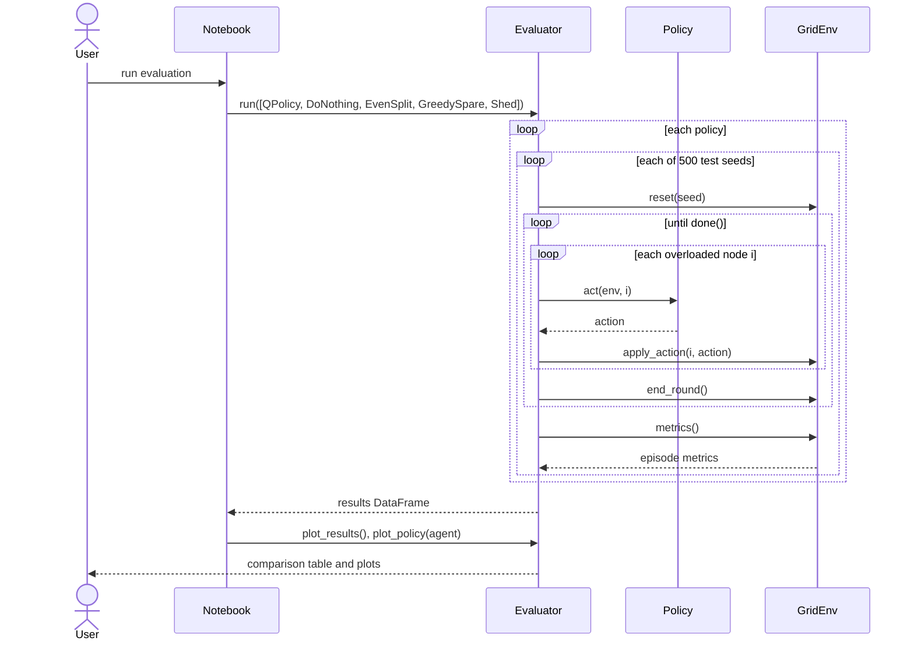

# Power Grid Resilience: Vulnerability Detection and Q-Learning Redistribution

Design document · 2026-10-02

## 1. Overview

We will build two tools on a 100-node synthetic power grid: a heuristic score that ranks nodes by vulnerability, and a Q-learning agent that chooses how to redistribute load from overloaded nodes so the fewest nodes fail. Both share one cascade simulator built from the dataset.

**Problem statements**

1. **Detect vulnerable nodes.** Rank every node by how likely it is to fail and how much harm its failure would cause. Method: a transparent weighted score, no learning.
2. **Choose the safest load redistribution.** When nodes are overloaded, decide where to move or shed load so the cascade stops with the fewest failures and the least shed load. Method: tabular Q-learning with one Q-table shared by all nodes.

**In scope:** cascade simulator, heuristic scoring, Q-learning environment and agent, comparison against four fixed-rule baselines, plots and a notebook.

**Out of scope:** AC/DC power-flow physics, predicting cascade size as a separate model, real grid data, deep RL (DQN). DQN is a possible follow-up if the tabular agent plateaus.

## 2. Data and assumptions

The input is one CSV, `data/power_grid_dataset_with_cascade_failures.csv`: 100 nodes, one static snapshot, no time series and no record of actions.

| Column | Meaning | Range | Used? |
| --- | --- | --- | --- |
| `node_id` | Node identifier | 1–100 | Yes |
| `x_coordinate`, `y_coordinate` | Position on a 100×100 plane | 0.2–99.9 | Yes, to rebuild links |
| `demand` | Load on the node (MW, assumed) | 105–982, mean 574 | Yes |
| `capacity` | Maximum load (MW, assumed) | 511–1999, mean 1206 | Yes |
| `status` | `active` / `damaged` | 68 / 32 | Yes, as the initial outage |
| `neighbors` | Linked node IDs, stored as a string | 4 per node | No (see below) |

**Known data issues**

- The `neighbors` column is not usable as a network. It has only 15 distinct lists repeated in a cycle, every link points to nodes 1–14, and 384 of 400 links are one-way.
- `status` does not follow overload: 13 nodes have demand above capacity, but only 3 of them are damaged.

**Assumptions (to confirm)**

- **A1 Topology.** Links are rebuilt as a symmetric 4-nearest-neighbour graph on the coordinates, giving each node about 4–7 links.
- **A2 Initial outage.** The 32 damaged nodes start offline. Their demand must still be served, so it is split equally among their active neighbours at the start of each episode.
- **A3 Units.** Demand and capacity are treated as MW.
- **A4 Physics.** A node fails when load > capacity after the agent has acted. A failed node's load is split equally among its active neighbours. No power-flow equations.
- **A5 Variation.** Each episode adds ±15% uniform noise to demand and, with probability 0.5, fails one extra random active node.

## 3. Architecture

The code is six Python modules in `src/`, with one notebook that drives them. `grid.py` and `cascade.py` are the shared core: Part A uses them directly, and Part B wraps them in an RL environment.

| Module | Main classes | Responsibility |
| --- | --- | --- |
| `grid.py` | `Node`, `PowerGrid` | Load the CSV, rebuild the k-NN topology, hold per-node load and status |
| `cascade.py` | `CascadeSimulator` | Apply outages, run one failure wave, run to stability, count failures and shed load |
| `heuristic.py` | `VulnerabilityAnalyzer` | Part A: compute stress, spillover and exposure, score, assign tiers, validate by simulation |
| `env.py` | `GridEnv`, `StateEncoder`, `Action`, `RewardConfig` | Part B: episode reset, state encoding, action application, reward |
| `agent.py` | `QLearningAgent`, `Trainer` | Q-table, ε-greedy action choice, Q-update, training loop |
| `evaluate.py` | `Policy` and 5 subclasses, `Evaluator` | Run the agent and four baselines on fixed test scenarios, produce metrics and plots |
| `viz.py` | — | Shared plot palette, matplotlib style, grid-map helpers |



**Notebook:** `notebooks/powergrid_rl.ipynb` runs Part A, trains the agent, runs the evaluation and shows all plots. The existing `src/Untitled.ipynb` is not reused.

**Dependencies:** `numpy` and `pandas` (already in `requirements.txt`), plus `matplotlib` for plots. No RL or graph library is needed; the k-NN graph and the Q-table are plain numpy.

**Reproducibility:** every random draw goes through a seeded `numpy.random.Generator`. Training and test scenarios use separate seed ranges, so the agent is never tested on an episode it trained on.

## 4. Class diagram



**Key responsibilities**

- `Node` holds the only mutable per-node state: `load` and `online`. `ratio() = load / capacity`, `spare() = max(0, capacity − load)`, `excess() = max(0, load − capacity)`.
- `PowerGrid.copy()` is a deep copy, so every episode and every validation run starts from a clean grid.
- `CascadeSimulator.step()` runs exactly one failure wave. That lets `GridEnv` interleave agent actions with physics.
- `GridEnv` does not own the agent. It exposes `apply_action` and `end_round`, so the same environment serves training (`Trainer`) and evaluation of any `Policy` (`Evaluator`).

## 5. Part A: Heuristic vulnerability detection

Each active node gets a score V between 0 and 1 from three measurements: how close it is to its own limit, whether its neighbours could absorb its load, and how much backup it has already lost. Scores are computed on the post-outage grid (A2), using each node's current `load`, not its raw `demand`.

| Metric | Definition | Meaning |
| --- | --- | --- |
| Stress sᵢ | loadᵢ / capacityᵢ | Above 1 = already overloaded |
| Spillover pᵢ | min(1, loadᵢ / Sᵢ), where Sᵢ = Σ max(0, capacityⱼ − loadⱼ) over active neighbours j | 1 = neighbours cannot absorb this node's load if it fails. Sᵢ = 0 gives pᵢ = 1 |
| Exposure fᵢ | offline neighbours / all neighbours | Share of backup already lost |

**Score**

```
V_i = 0.5 · min(s_i, 1.5) / 1.5  +  0.35 · p_i  +  0.15 · f_i        (0 ≤ V_i ≤ 1)
```

The weights put the node's own stress first, spillover second and exposure third. They are constructor parameters of `VulnerabilityAnalyzer`, so they can be tuned without code changes.

**Tiers**

| Tier | Rule |
| --- | --- |
| Critical | sᵢ > 1, regardless of V |
| High | V ≥ 0.6 |
| Medium | 0.4 ≤ V < 0.6 |
| Low | V < 0.4 |
| Offline | Node is damaged (A2); not scored |

**Validation by simulation**

1. Run the post-outage grid to stability with no intervention, one failure wave at a time.
2. Label each active node with the wave in which it fails, or *survived*.
3. Report the Spearman rank correlation between V and earliness of failure, and the AUC: the probability that a node that failed has a higher V than a node that survived.
4. Repeat both on non-Critical nodes only, since Critical nodes fail in wave 1 by definition.

*Revised during implementation.* The first plan failed each node alone and counted the extra failures. On this data the uncontrolled cascade already takes out 54 of the 68 active nodes, so a single extra failure changes almost nothing and the check was meaningless (ρ = −0.25).

**Result on the dataset:** ρ = 0.81 and AUC = 0.82 over all active nodes; ρ = 0.59 and AUC = 0.71 over non-Critical nodes.

**Outputs:** a ranked table (node, s, p, f, V, tier, failure wave in the uncontrolled cascade) and a map of the grid coloured by tier.

## 6. Part B: Q-learning load redistribution

A single tabular Q-learning agent learns one shared Q-table of 64 states × 5 actions. Each overloaded node looks up its own local state and picks an action from the same table. This keeps the table small enough to train in about a minute while still generalising across all 100 nodes.

### 6.1 Episode

1. **Reset.** Copy the base grid, apply ±15% demand noise, take the damaged nodes offline, optionally fail one extra random node (A5), and split the offline load to active neighbours (A2).
2. **Round.** Repeat until no node is overloaded or 20 rounds have passed:
    1. Pick the most overloaded active node that has not acted yet this round (`next_actor()`). The list is re-checked after every action, so a node pushed over capacity by a neighbour earlier in the round also gets to act.
    2. Encode its state, choose an action and apply it. Repeat from step 1 until every overloaded node has acted once.
    3. Run one failure wave (`CascadeSimulator.step()`): every node still above capacity fails, and its load is split equally among its active neighbours.
    4. Compute each acting node's reward and next state, and emit one transition per acting node.
3. **End.** Record failures, shed load, demand served and rounds taken.

### 6.2 State (64 states)

The state of overloaded node i is three binned features. Index = 16 · ratio_bin + 4 · headroom_bin + failed_bin.

| Feature | Definition | Bins |
| --- | --- | --- |
| Overload ratio | loadᵢ / capacityᵢ | (1.0, 1.1], (1.1, 1.25], (1.25, 1.5], > 1.5 |
| Best-neighbour headroom | max spare of active neighbours / excessᵢ | 0, (0, 0.5), [0.5, 1), ≥ 1 |
| Failed neighbours | count of offline neighbours | 0, 1, 2, 3+ |

### 6.3 Actions

Actions are defined relative to the node's own neighbours, so one table works for every node. "Best neighbour" = the active neighbour with the most spare capacity.

| # | Action | Effect |
| --- | --- | --- |
| 0 | `HOLD` | Do nothing |
| 1 | `SHIFT_HALF_BEST` | Move 50% of the excess to the best neighbour |
| 2 | `SHIFT_ALL_BEST` | Move 100% of the excess to the best neighbour |
| 3 | `SPLIT_PROPORTIONAL` | Split the excess across all active neighbours, in proportion to their spare capacity |
| 4 | `SHED_EXCESS` | Reduce the node's load to its capacity; the excess counts as shed (unserved) load |

If a node has no active neighbours, actions 1–3 behave as `HOLD`.

A sixth action, `SPLIT_EVEN` (split the excess equally across active neighbours), exists only for `EvenSplitPolicy`. It is not in the agent's action set.

### 6.4 Reward

Each transition gets a local reward for node i, computed after the round's failure wave:

```
r_i = −10 · [i failed]
      −10 · (number of neighbours that received load from i this round and failed)
      −1  · (load shed by i, in units of 100 MW)
      −0.1
      +5  · [i and all its active neighbours are within capacity]
```

The ratio between the failure penalty and the shed penalty decides the agent's character: if shedding is too cheap it sheds every time; if it is too expensive it accepts failures. All four values live in `RewardConfig`.

**Terminal transitions.** A transition is terminal when node i failed or is no longer overloaded. Otherwise its next state is node i's encoded state at the start of the next round.

### 6.5 Learning rule and hyperparameters

```
Q(s, a) ← Q(s, a) + α · [ r + γ · max_a' Q(s', a') − Q(s, a) ]     (max term = 0 if terminal)
```

| Parameter | Value |
| --- | --- |
| Learning rate α | 0.1 |
| Discount γ | 0.9 |
| Exploration ε | 1.0 → 0.05, linear over the first 4,000 episodes |
| Training episodes | 5,000 |
| Max rounds per episode | 20 |
| Q-table initialisation | zeros |
| Training seeds | 0–4,999 |

## 7. Sequence diagrams

### 7.1 Part A: vulnerability scoring and validation



### 7.2 Part B: one training episode



### 7.3 Part B: evaluation against baselines



## 8. Evaluation plan

The agent and four fixed rules run on the same 500 test scenarios (seeds 100,000–100,499, disjoint from training). The agent runs greedily (ε = 0).

**Baselines**

| Policy | Rule |
| --- | --- |
| `DoNothingPolicy` | Always `HOLD`: shows the uncontrolled cascade |
| `EvenSplitPolicy` | Split the excess equally across active neighbours |
| `GreedySparePolicy` | Always `SHIFT_ALL_BEST` |
| `ShedPolicy` | Always `SHED_EXCESS`: no failures, maximum shed load |

**Metrics** (mean ± std over the 500 scenarios)

- Nodes failed beyond the initial outage
- Load shed (MW)
- Demand served (% of total demand). Unserved = shed load + load lost when a failed node had no active neighbour left.
- Rounds to stability

**Success criterion:** the agent fails fewer nodes than every non-shedding baseline, and sheds less load than `ShedPolicy`, by a margin larger than one standard error.

**Plots**

- Training curve: episode reward and failures, rolling mean over 100 episodes
- Bar chart of each metric per policy
- Learned policy: best action per state, as a 4 × 16 heatmap
- One test episode replayed round by round on the grid map

## 9. Limitations, risks and open questions

**Limitations**

- Results come from a simulator built on synthetic data. They show that the method works, not that it works on real grids.
- Load moves along links with no power-flow constraints (A4). Real grids follow Kirchhoff's laws and line limits.
- `status` is not tied to any cascade, so it cannot be used as ground truth for either part.

**Risks**

| Risk | Mitigation |
| --- | --- |
| Agent learns to shed every time | Tune `shed_per_100mw`; report the trade-off curve across several values |
| Shared reward makes credit assignment noisy | Rewards are local to each node (6.4), not global |
| 64 states too coarse to beat `GreedySparePolicy` | Add a bin or feature (for example, second-best headroom); escalate to DQN if needed |
| Initial outage too mild or too severe | Check the `DoNothingPolicy` failure count first; adjust the noise level or the extra-failure probability |

**Open questions**

- [ ] A1: Is a 4-nearest-neighbour topology acceptable, or is real link data available?
- [ ] A2: Should damaged nodes start offline with their load pushed to neighbours?
- [ ] Are the Part A weights 0.5 / 0.35 / 0.15 acceptable as a starting point?
- [ ] Penalty balance: one failure = 1,000 MW of shed load. Should failures weigh more?
