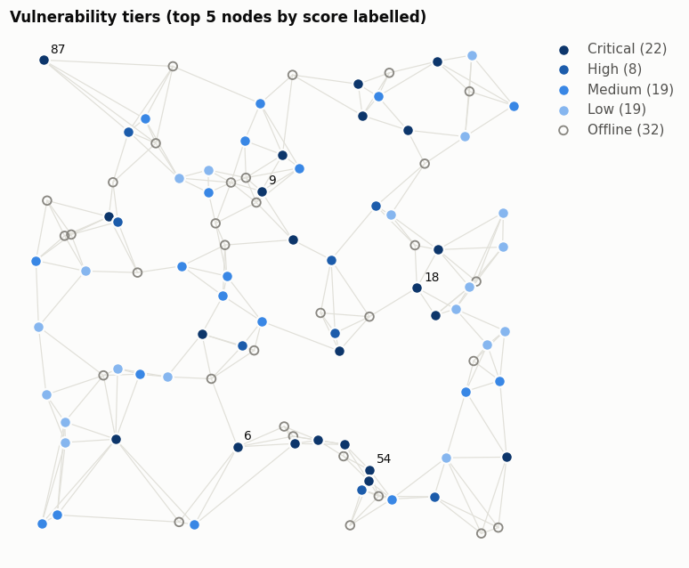
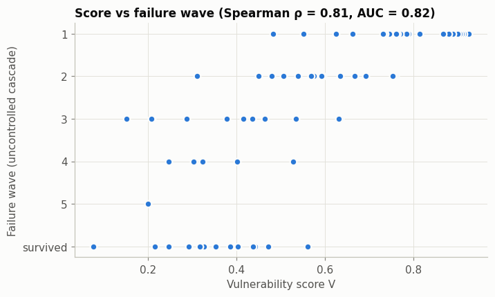
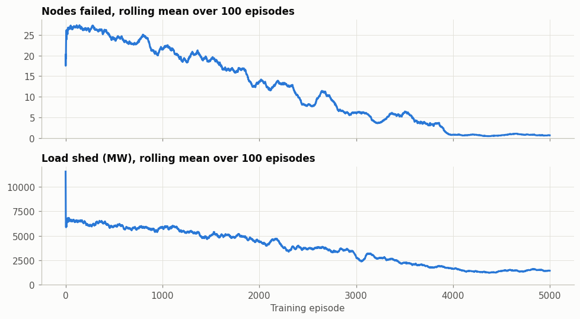
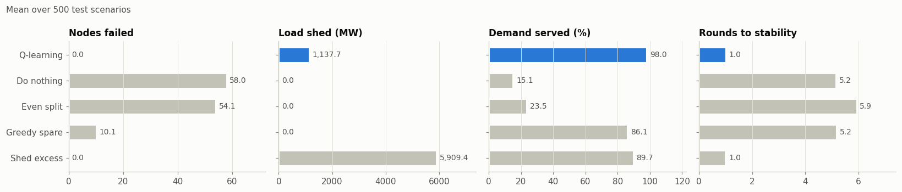
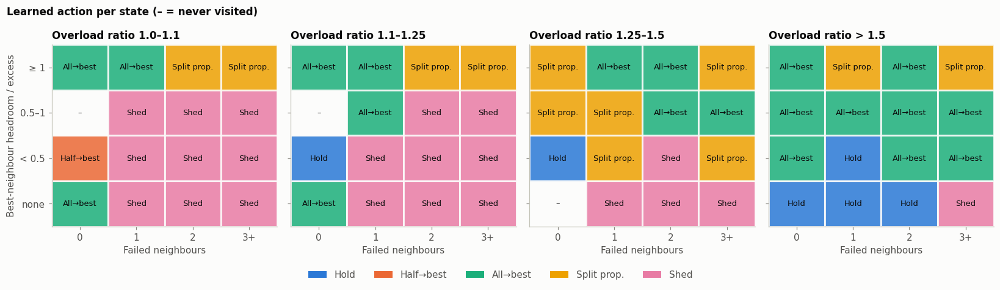
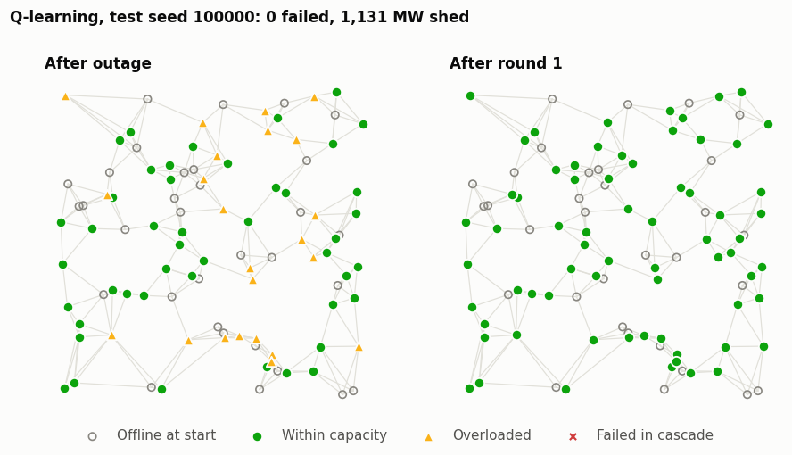
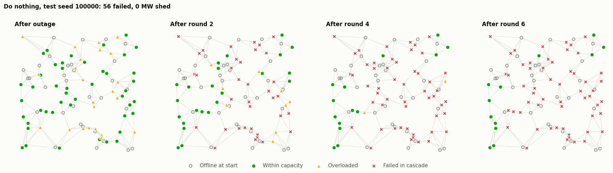

# Power Grid Resilience: Vulnerability Detection and Q-Learning Load Redistribution

Project report · 2026-10-02

## Summary

This project tackles two problems on a 100-node synthetic power grid:

1. **Detecting vulnerable nodes** with a simple, transparent heuristic score.
2. **Choosing the safest load redistribution** with tabular Q-learning.

**Results.** The heuristic score ranks nodes in close agreement with the order they fail in a simulated cascade (Spearman ρ = 0.81). Across 500 unseen test scenarios, the Q-learning agent kept the grid almost entirely intact: 0.01 node failures and 98.0% of demand served on average. With no intervention, 58 nodes fail and 15.1% of demand is served. The best rule that never sheds load loses 10.1 nodes. Shedding all excess load loses no nodes, but sheds 5.2× more load than the agent.

The full technical design, with class and sequence diagrams, is in [design.md](design.md). Technical terms are explained in plain language where they first appear, and all of them are collected in the [Glossary](#7-glossary) at the end.

**The idea in one paragraph.** A power grid is a network of stations that pass electricity to each other. If one station is overloaded and shuts down, its load is pushed onto its neighbours, which can overload them too, like dominoes falling. This chain reaction is called a *cascade failure*. We ask two questions. First, which stations are most at risk? We answer that with a simple scoring formula. Second, when stations are overloaded, where should the extra load go so that the dominoes stop falling? For that, we let a computer program learn by trial and error, rewarding it when the grid survives and penalising it when stations fail.

---

## 1. The data

**File:** `data/power_grid_dataset_with_cascade_failures.csv`. It holds 100 nodes, one row per node, in a single static snapshot. There is no time series and no record of past actions.

| Column | Meaning | Range |
| --- | --- | --- |
| `node_id` | Node identifier | 1–100 |
| `x_coordinate`, `y_coordinate` | Position on a 100 × 100 plane | 0.2–99.9 |
| `demand` | Load the node must serve (treated as MW) | 105–982, mean 574, total 57,360 |
| `capacity` | Maximum load the node can carry (MW) | 511–1,999, mean 1,206 |
| `status` | `active` or `damaged` | 68 active, 32 damaged |
| `neighbors` | Linked node IDs, stored as a string such as `"[1, 5, 10, 11]"` | 4 per node |

**Data quality issues and how we handled them**

| Issue | Evidence | How we handled it |
| --- | --- | --- |
| The `neighbors` column is not a usable network | Only 15 distinct lists, repeated in a cycle. Every link points to nodes 1–14. 384 of 400 links are one-way. | Ignored. Links were rebuilt by connecting each node to its 4 nearest nodes by position, made two-way: 245 links, 4–9 per node. |
| `status` is not explained by overload | 13 nodes have demand above capacity, but only 3 of them are damaged | Treated `damaged` as an outage that has already happened (see assumptions) |
| No units | Neither column has units | Demand and capacity are treated as MW |

**Modelling assumptions**

- **Initial outage.** The 32 damaged nodes start offline. Their demand must still be served, so it is split equally among their active neighbours. This leaves 22 nodes overloaded before anything else happens.
- **Cascade rule.** A node fails when its load exceeds its capacity. Its load is then split equally among its active neighbours, which can overload them in turn. If a failed node has no active neighbour left, its load is lost (unserved).
- **Scenario variety.** Each training or test scenario adds ±15% random noise to every node's demand. In half of the scenarios, one extra random node is also failed.

---

## 2. How to run the code

**Requirements:** Python 3 (developed with 3.9), plus the packages in `requirements.txt`: `jupyterlab`, `numpy`, `pandas`, `matplotlib`.

**First-time setup**, from the repository root:

```bash
bash setup.sh
```

The script does five things:

1. Creates the `venv/` virtual environment.
2. Installs `ipykernel` and the packages from `requirements.txt` into it.
3. Registers that environment as a Jupyter kernel named **Python (myenv)**.
4. Installs JupyterLab globally for your user (`pip3 install --user jupyterlab`).
5. Launches JupyterLab on port 8888 without opening a browser. Open the URL it prints, and press Ctrl+C in that terminal to stop it.

Because the script ends by launching JupyterLab, it is only needed once. If `venv/` already exists, install any new packages into it instead:

```bash
source venv/bin/activate
pip install -r requirements.txt
```

**Option 1: notebook (recommended).**

```bash
source venv/bin/activate
jupyter lab
```

Open `notebooks/powergrid_rl.ipynb`, select the **Python (myenv)** kernel, and run all cells. A full run takes about 2 minutes, most of it training the agent. The notebook shows every table and plot in this report.

**Option 2: regenerate the report figures from the command line.**

```bash
source venv/bin/activate
python src/report_figures.py
```

This writes all the figures to `docs/figures/` and prints the numbers used in this report. Every random draw is seeded, so the results reproduce exactly.

**Code layout**

| File | Contents |
| --- | --- |
| `src/grid.py` | `Node`, `PowerGrid`: load the CSV, rebuild the nearest-neighbour links |
| `src/cascade.py` | `CascadeSimulator`: initial outage, failure waves, shed and lost load |
| `src/heuristic.py` | `VulnerabilityAnalyzer`: Part A scoring, tiers, validation, risk map |
| `src/env.py` | `GridEnv`, `StateEncoder`, `Action`, `RewardConfig`: the Part B environment |
| `src/agent.py` | `QLearningAgent`, `Trainer`: Q-table and training loop |
| `src/evaluate.py` | `Policy` and its five subclasses, `Evaluator`: comparison against baselines, plots |
| `src/viz.py` | Shared plot colours and style |
| `src/report_figures.py` | Regenerates the figures in this report |
| `notebooks/powergrid_rl.ipynb` | Runs everything end to end |

---

## 3. Approach

### 3.1 Part A: Vulnerability detection (heuristic)

A node is vulnerable if it is **likely to fail** and its failure would **harm its neighbours**. Each active node gets three measurements, taken on the grid just after the initial outage:

| Metric | Formula | What it means |
| --- | --- | --- |
| Stress s | load ÷ capacity | How close the node is to its own limit. Above 1 means already overloaded. |
| Spillover p | min(1, load ÷ total spare capacity of active neighbours) | 1 means the neighbours could not absorb this node's load if it failed |
| Exposure f | offline neighbours ÷ all neighbours | How much backup the node has already lost |

These are combined into a score between 0 and 1:

```
V = 0.5 · min(s, 1.5)/1.5  +  0.35 · p  +  0.15 · f
```

**Why these weights.** The node's own stress gets the largest weight (0.5), because it decides whether the node fails at all. Spillover comes next (0.35), because it decides whether that failure spreads to the neighbours. Exposure gets the smallest weight (0.15): losing backup matters, but only once the first two are already high. Stress is capped at 1.5 so that one extremely overloaded node cannot dominate the scale. The weights are a starting point, not fitted values. They are parameters of `VulnerabilityAnalyzer` and can be changed without touching the code.

Each node is then placed in a risk tier:

| Tier | Rule |
| --- | --- |
| Critical | s > 1 (already overloaded) |
| High | V ≥ 0.6 |
| Medium | 0.4 ≤ V < 0.6 |
| Low | V < 0.4 |
| Offline | Damaged at the start; not scored |

**Validation.** The cascade is run with no intervention, and each node is labelled with the failure wave in which it goes down, or *survived*. A good score should rank nodes that fail early above nodes that fail late or survive. Two measures are reported:

- **Spearman correlation (ρ)** between the score and how early the node fails. In plain terms: sort the nodes by score, then sort them by how early they failed, and ask how similar the two orders are. ρ = 1 means identical, 0 means no relationship, −1 means exactly reversed.
- **AUC:** pick one node that failed and one that survived, at random. The AUC is the chance that the failed one has the higher score. 0.5 is no better than tossing a coin; 1.0 is perfect.

Both are also computed on non-Critical nodes alone, because Critical nodes fail in wave 1 by definition.

### 3.2 Part B: Load redistribution (Q-learning)

**The intuition.** Think of a person learning a video game with no instructions. They try a move, see whether they gain or lose points, and remember which moves worked in which situations. After thousands of games they play well, even though nobody told them the rules. This is *reinforcement learning*. *Q-learning* is one version of it, in which the "memory" is a table:

- one row for each situation (*state*),
- one column for each possible move (*action*),
- and in each cell, a score (*Q-value*) for how good that move has turned out to be in that situation.

At first every score is zero and the program tries moves at random. Each time a move leads to stations failing, its score goes down. Each time it keeps the grid safe, its score goes up. Over time, the best move in each row ends up with the highest score.

**How we apply it.** Load redistribution is a step-by-step decision problem, which is what reinforcement learning is designed for. One agent learns a single **Q-table** that every node shares. Each overloaded node looks up its own local situation in the table and picks an action.

**How an episode runs**

1. Start from the dataset, add demand noise, take the damaged nodes offline, and push their load to neighbours.
2. Each round:
    1. Every overloaded node chooses an action, most overloaded first.
    2. Then one failure wave runs: every node still over capacity fails, and its load spreads to its neighbours.
3. Rounds repeat until no node is overloaded, or 20 rounds have passed.

**State: what a node sees (64 combinations)**

| Feature | Levels |
| --- | --- |
| Its overload ratio (load ÷ capacity) | 1.0–1.1, 1.1–1.25, 1.25–1.5, above 1.5 |
| The best neighbour's spare capacity ÷ this node's excess | none, under 0.5, 0.5–1, 1 or more |
| Failed neighbours | 0, 1, 2, 3+ |

**Actions**

| Action | Effect |
| --- | --- |
| Hold | Do nothing |
| Half → best | Move 50% of the excess to the neighbour with the most spare capacity |
| All → best | Move 100% of the excess to that neighbour |
| Split proportionally | Spread the excess over all active neighbours, in proportion to their spare capacity |
| Shed | Cut the excess load. The node is safe, but that demand goes unserved. |

**Reward per node, per round**

| Event | Reward |
| --- | --- |
| The node fails | −10 |
| Each neighbour it pushed load to fails | −10 each |
| Load shed | −1 per 100 MW |
| Each round taken | −0.1 |
| The node and its neighbours end the round within capacity | +5 |

The balance between the failure penalty and the shedding penalty decides the agent's behaviour. If shedding is cheap, it sheds everything. If shedding is expensive, it accepts failures.

**Learning rule.** The Q-table holds Q(s, a): the expected total future reward of taking action a in state s. After every round, each node that acted updates its table entry:

```
Q(s, a) ← Q(s, a) + α · [ r + γ · max over a' of Q(s', a')  −  Q(s, a) ]
```

- s, a: the node's state and the action it took.
- r: the reward it received that round.
- s': its state at the start of the next round. If the node failed or is no longer overloaded, the episode is over for that node and the max term is 0.
- α (learning rate): how far each update moves the old value toward the new estimate.
- γ (discount): how much future rewards count compared with immediate ones.

In words: the new score = the old score, nudged toward "the reward I just got, plus the best score I can expect from where I ended up". With α = 0.1, each nudge moves the score 10% of the way. That is why learning takes thousands of episodes, and also why one unlucky episode cannot ruin what has been learned. With γ = 0.9, a reward one round later counts 90% as much as an immediate one, so the agent cares about what happens next, not only right now.

**Choosing actions.** During training the agent uses ε-greedy choice. With probability ε it tries a random action (exploration); otherwise it takes the action with the highest Q-value (exploitation). In evaluation it always takes the best action. The reason for random moves: if the agent always picked the move that currently looks best, it might never discover that another move is even better. It is like always ordering the same dish at a restaurant; you never find out whether something else on the menu is better.

**Training settings.** α = 0.1, γ = 0.9, 5,000 episodes, with the Q-table starting at zero. ε falls linearly from 1.0 to 0.05 over the first 4,000 episodes, so the agent explores widely at first and mostly uses what it has learned at the end. Training takes about 50 seconds.

**Evaluation.** The trained agent (always choosing its best action) and four fixed rules each run on the same 500 test scenarios. These use seeds 100,000–100,499, which the agent never saw in training.

| Baseline | Rule |
| --- | --- |
| Do nothing | Never intervene; shows the uncontrolled cascade |
| Even split | Spread the excess equally over all active neighbours |
| Greedy spare | Always move all of the excess to the neighbour with the most spare capacity |
| Shed excess | Always cut the excess |

---

## 4. Results

### 4.1 Part A: Vulnerable nodes

After the initial outage, the 68 active nodes split into **22 Critical, 8 High, 19 Medium and 19 Low**.



**The 10 most vulnerable nodes**

| Node | Load (MW) | Capacity (MW) | Stress s | Spillover p | Exposure f | Score V | Tier |
| --- | --- | --- | --- | --- | --- | --- | --- |
| 9 | 1,257 | 788 | 1.60 | 1.00 | 0.50 | 0.92 | Critical |
| 6 | 1,449 | 1,041 | 1.39 | 1.00 | 0.67 | 0.91 | Critical |
| 18 | 984 | 655 | 1.50 | 1.00 | 0.40 | 0.91 | Critical |
| 87 | 1,342 | 933 | 1.44 | 1.00 | 0.50 | 0.90 | Critical |
| 54 | 991 | 642 | 1.54 | 1.00 | 0.33 | 0.90 | Critical |
| 35 | 1,504 | 1,115 | 1.35 | 1.00 | 0.60 | 0.89 | Critical |
| 34 | 1,424 | 1,170 | 1.22 | 1.00 | 0.83 | 0.88 | Critical |
| 25 | 1,241 | 936 | 1.33 | 1.00 | 0.50 | 0.87 | Critical |
| 31 | 875 | 748 | 1.17 | 1.00 | 0.50 | 0.81 | Critical |
| 63 | 803 | 713 | 1.13 | 1.00 | 0.43 | 0.79 | Critical |

**Validation.** With no intervention, the cascade takes out 54 of the 68 active nodes in 5 waves. The score agrees well with what actually happens:

| Nodes | Spearman ρ | AUC |
| --- | --- | --- |
| All active nodes (68) | 0.81 | 0.82 |
| Non-Critical only (46) | 0.59 | 0.71 |



**In plain terms:** if you pick one node that failed and one that survived, the failed one has the higher score 82% of the time. A coin toss would manage only 50%. So the simple formula is a good early warning, without needing to simulate anything.

Nodes with high scores fail in the first two waves, and every survivor has a score below 0.6. The non-Critical figures are the stronger test, since they exclude nodes that fail by definition. The score still separates early failures from survivors well above chance (AUC 0.5).

### 4.2 Part B: Load redistribution

**Training.** Average failures per episode fell from about 26 at the start of training to under 1. Shed load fell from about 6,000 MW to about 1,400 MW over the same period.



**Comparison on 500 test scenarios** (mean ± standard deviation)

How to read "1,138 ± 347": averaged over the 500 scenarios, the agent shed 1,138 MW. The standard deviation, 347, shows how much this varied from one scenario to the next; most scenarios fall within roughly 347 MW of the average.

| Policy | Nodes failed | Load shed (MW) | Demand served (%) | Rounds |
| --- | --- | --- | --- | --- |
| **Q-learning** | **0.01 ± 0.09** | **1,138 ± 347** | **98.0 ± 0.6** | **1.0** |
| Do nothing | 57.96 ± 2.87 | 0 | 15.1 ± 3.9 | 5.2 |
| Even split | 54.05 ± 6.34 | 0 | 23.5 ± 11.1 | 5.9 |
| Greedy spare | 10.13 ± 4.78 | 0 | 86.1 ± 8.6 | 5.2 |
| Shed excess | 0.00 | 5,909 ± 434 | 89.7 ± 0.7 | 1.0 |



What the comparison shows:

- **Every intervention beats doing nothing.** But spreading load evenly barely helps (54 failures instead of 58), because it pushes load onto neighbours that are already stressed.
- **Greedy spare is the best rule that never sheds,** yet it still loses about 10 nodes per scenario.
- **Shed excess is safe but wasteful.** It loses no nodes, but cuts 5,909 MW, about 10% of all demand.
- **Q-learning gets the best of both.** It matches the shed rule's near-zero failures while shedding 81% less load (1,138 MW), and it serves the most demand of any policy (98.0%). It also settles the grid in a single round.

**Was the goal met?** Before running the experiment, the design set a target: the agent should have fewer failures than every rule that does not shed load, and less shed load than the always-shed rule. In both cases the gap had to be larger than the random variation between scenarios (one *standard error*). The agent meets both targets by a wide margin:

| Comparison | Agent | Best competing rule | Gap | Standard error of the gap |
| --- | --- | --- | --- | --- |
| Nodes failed vs Greedy spare | 0.01 | 10.13 | 10.12 fewer | about 0.21 |
| Load shed vs Shed excess | 1,138 MW | 5,909 MW | 4,771 MW less | about 25 MW |

Each gap is about 50 to 190 times its standard error, so the difference is far larger than chance variation between scenarios. One caution: the agent was trained only once. A different starting seed for training could give a somewhat different table, although we would expect a similar result.

Training also explored 61 of the 64 possible states. The 3 states it never saw are marked "–" in the chart below; if one ever occurred, the agent would default to *Hold*.

**What the agent learned**



- **When a neighbour has enough spare capacity** (top row of each panel), the agent moves the excess there, either all to the best neighbour or split proportionally.
- **When there is little room nearby and some neighbours have already failed,** it sheds. Pushing load would likely overload the remaining neighbours and start a chain of failures.
- **When it is barely overloaded and no neighbours have failed,** it still prefers to move load rather than shed.
- **One questionable choice:** in the most extreme states (overload above 1.5 and no spare capacity nearby), it learned to hold. These states are rare in practice, so the table has little experience of them.

**One test scenario, step by step (seed 100,000)**

With the Q-learning agent, the grid is stable after one round: 0 failures and 1,131 MW shed.



With no intervention, 56 nodes fail across 6 rounds.



---

## 5. Limitations

- **Synthetic data.** The results show that the method works on this simulated grid, not that it would work on a real one.
- **Simplified physics.** Load moves along links with no power-flow equations or line limits. Real grids follow Kirchhoff's laws.
- **Rebuilt topology.** The links come from geographic proximity because the dataset's own `neighbors` column was unusable.
- **No ground truth.** The dataset's `status` column does not record any cascade, so both parts are validated against the simulator rather than observed failures.
- **Reward weights are a choice.** One failure is valued the same as 1,000 MW of shed load. Different weights would trade more failures for less shedding, or the reverse.

## 6. Possible next steps

- Sweep the shedding penalty to map the full trade-off between failures and shed load.
- Test the agent on harsher scenarios: more noise, or several extra failures at once.
- Replace the equal-split cascade rule with DC power flow for more realistic physics.
- Move to a Deep Q-Network if a richer state (for example, second-best neighbour headroom) is needed.
- Train with several different seeds to confirm the result does not depend on one lucky run.

## 7. Glossary

**Power grid terms**

| Term | Meaning |
| --- | --- |
| Node | One station in the grid that serves some demand. The dataset has 100. |
| MW (megawatt) | A unit of electrical power. 1 MW is roughly enough for several hundred homes. |
| Demand / load | How much power a node has to deliver. *Demand* is what its customers need; *load* is what it is actually carrying, which grows when neighbours pass load to it. |
| Capacity | The most load a node can carry before it shuts down. |
| Overloaded | Carrying more load than capacity. *Excess* is the amount above capacity. |
| Cascade failure | A chain reaction: one node fails, its load moves to its neighbours, they overload and fail, and so on. |
| Failure wave | One step of a cascade: every overloaded node fails at the same moment. |
| Load shedding | Deliberately cutting off some customers' power so that a node stays within capacity. It prevents failures, but those customers lose power. |
| Topology | The pattern of links: which nodes are connected to which. |
| k-nearest neighbours | A way of building links: connect each node to the k nodes closest to it on the map. We used k = 4. |
| Power flow, Kirchhoff's laws | The physics of how electricity actually moves through a real grid. Our simulator simplifies this; see the Limitations section. |

**Scoring terms (Part A)**

| Term | Meaning |
| --- | --- |
| Heuristic | A rule of thumb: a simple formula built from common sense, rather than learned from data. |
| Stress, spillover, exposure | The three measurements that make up the vulnerability score; see section 3.1. |
| Spearman correlation (ρ) | Measures how similar two rankings are. 1 means the same order, 0 means unrelated, −1 means reversed. |
| AUC | The chance that a randomly chosen failed node scores higher than a randomly chosen survivor. 0.5 is coin-toss level; 1.0 is perfect. |

**Learning terms (Part B)**

| Term | Meaning |
| --- | --- |
| Reinforcement learning | Learning by trial and error from rewards and penalties, instead of from labelled examples. |
| Agent | The program that makes decisions and learns. |
| Q-learning | A reinforcement learning method that keeps a table of how good each action is in each situation. |
| Q-table, Q-value | The table, and one score in it. A higher Q-value means a better action in that state. |
| State | The situation the agent sees before deciding; here, three facts about an overloaded node. |
| Action | One of the moves the agent can make, such as "move all excess to the best neighbour". |
| Reward | Points given after an action: negative for failures and shedding, positive for a stable grid. |
| Episode | One complete scenario, from the initial outage until the grid is stable or 20 rounds have passed. |
| Policy | A rule for choosing actions. The trained agent is one policy; the fixed rules are others. |
| Baseline | A simple policy used for comparison, to show whether the learned one is actually better. |
| Exploration / exploitation | Trying random actions to learn more, versus using the best action found so far. |
| ε (epsilon) | The probability of exploring. It starts at 1.0 (always random) and falls to 0.05. |
| α (learning rate) | How big each update to a Q-value is. 0.1 means a 10% step. |
| γ (discount factor) | How much future rewards count compared with immediate ones. 0.9 means a reward one step later is worth 90%. |

**Statistics terms**

| Term | Meaning |
| --- | --- |
| Mean ± standard deviation | The average, and how much individual results typically spread around it. |
| Standard error | How uncertain an average is. It shrinks as more scenarios are tested. |
| Seed | A starting number for the random number generator. The same seed always gives the same "random" results, so experiments can be repeated exactly. |
| Training vs test scenarios | The agent learns on training scenarios and is graded on separate test scenarios it has never seen, so it cannot simply memorise the answers. |
